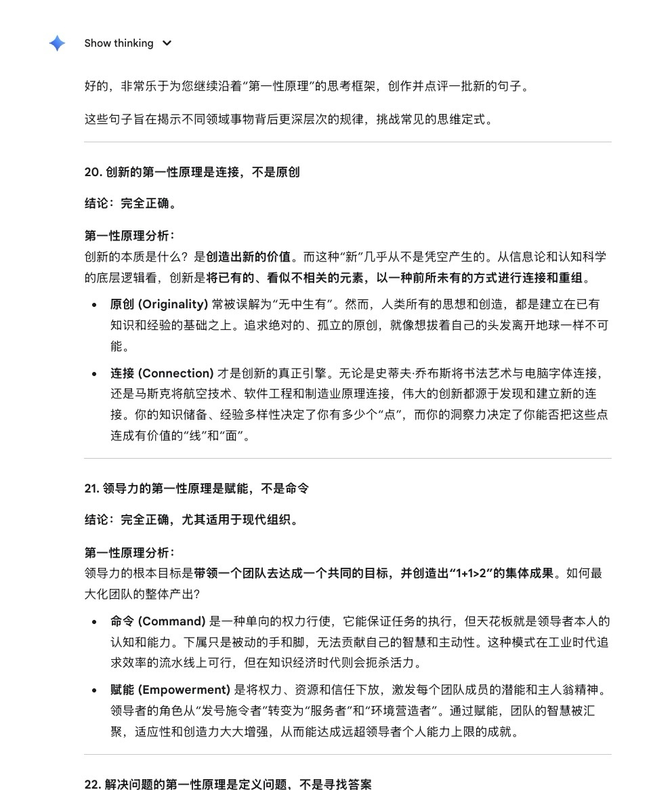
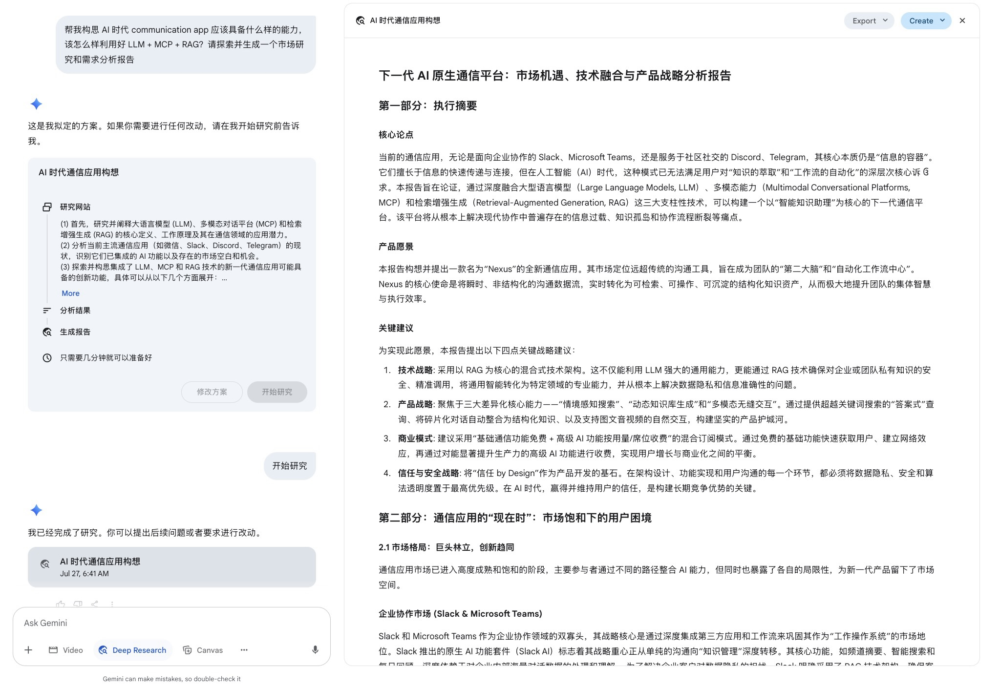

## 创新的第一性原理是连接，不是原创

创新的本质是什么？是创造出新的价值。而这种“新”几乎从不是凭空产生的。从信息论和认知科学的底层逻辑看，创新是将已有的、看似不相关的元素，以一种前所未有的方式进行连接和重组。

原创 (Originality) 常被误解为“无中生有”。然而，人类所有的思想和创造，都是建立在已有知识和经验的基础之上。追求绝对的、孤立的原创，就像想拔着自己的头发离开地球一样不可能。

连接 (Connection) 才是创新的真正引擎。无论是史蒂夫·乔布斯将书法艺术与电脑字体连接，还是马斯克将航空技术、软件工程和制造业原理连接，伟大的创新都源于发现和建立新的连接。你的知识储备、经验多样性决定了你有多少个“点”，而你的洞察力决定了你能否把这些点连成有价值的“线”和“面”。

## 领导力的第一性原理是赋能，不是命令

领导力的根本目标是带领一个团队去达成一个共同的目标，并创造出“1+1>2”的集体成果。如何最大化团队的整体产出？

命令 (Command) 是一种单向的权力行使，它能保证任务的执行，但天花板就是领导者本人的认知和能力。下属只是被动的手和脚，无法贡献自己的智慧和主动性。这种模式在工业时代追求效率的流水线上可行，但在知识经济时代则会扼杀活力。

赋能 (Empowerment) 是将权力、资源和信任下放，激发每个团队成员的潜能和主人翁精神。领导者的角色从“发号施令者”转变为“服务者”和“环境营造者”。通过赋能，团队的智慧被汇聚，适应性和创造力大大增强，从而能达成远超领导者个人能力上限的成就。



```rust
fn main() {
    println!("Hello, world!");
}
```

## 解决问题的第一性原理是定义问题，不是寻找答案

解决问题的本质是消除现状与期望之间的差距。

寻找答案是在已经明确“差距”是什么之后采取的行动。但如果我们对问题的定义本身就是错的，那么我们找到的每一个答案，无论多么精妙，都只是在一个错误的战场上打赢了一场无关紧要的战役。

定义问题是整个过程中最关键、也最需要智慧的一步。它要求我们深入探究表象之下真正的根本原因（Root Cause）。爱因斯坦曾说：“如果我有一个小时来拯救世界，我会花55分钟来定义问题，只花5分钟来寻找解决方案。” 精准地定义了问题，解决方案往往会自然浮现。



## 谈判的第一性原理是共赢，不是征服

谈判的根本目的是通过与他人的协商，达成一个比不协商更好的结果。这是一个寻求合作以创造增量的过程，而非零和博弈。

征服 (压倒对方) 将谈判视为一场战争，目标是让对方输，自己赢。这种心态可能让你在单次博弈中获得短期利益，但会损害长期关系，甚至导致谈判破裂，最终双方都得不到任何好处。

共赢 (寻找共同利益) 是将双方视为解决共同问题的合作伙伴。它要求我们从“立场”之争，转向挖掘双方背后真正的“利益”所在，然后通过创造性地“做大蛋糕”来满足双方的核心需求。只有建立在共赢基础上的协议，才是最稳固、最能被忠实执行的。

## 财富的第一性原理是资产，不是收入

财富的本质是一个人可以不工作也能维持生活的能力，它是一种持久的经济自由状态。

收入 (Income) 是你通过出卖自己的时间或劳动换来的现金流。它通常是“主动”的，手停口停。高收入不等于富有，一个高收入但高消费的“月光族”，其财务状况是极其脆弱的。

资产 (Asset) 是那些不需要你主动工作就能持续为你带来现金流的东西，比如能收租的房产、能分红的股票、有版权的书籍等。财富的积累，其核心就是不断地将主动收入，转化为能产生“被动收入”的优质资产。衡量财富的真正标尺，是你拥有的生钱资产的规模和质量。

## 写作的第一性原理是结构，不是辞藻

写作的根本目的是清晰、高效地传递思想和信息，并说服、感染读者。

辞藻 (Flowery Language) 是文章的“皮肤”或“衣服”。华丽的辞藻或许能带来一时的美感，但如果文章本身逻辑混乱、思想空洞，辞藻再美也只是金玉其外败絮其中，读者读完后只会感到不知所云。

结构 (Structure) 是文章的“骨架”。清晰的结构决定了思想传递的逻辑和条理，让读者能够毫不费力地跟上你的思路，理解你的核心论点。好的结构本身就具有强大的说服力。在坚实的骨架之上，再配以精准、简洁的语言（辞藻），文章才能真正拥有生命力。

## 健身的第一性原理是坚持，不是强度

健身的本质是通过持续对身体施加略超当前负荷的压力，引发身体的适应性改变（变得更强壮）。这个过程符合“超量恢复”原理。

强度 (Intensity) 是单次训练的压力水平。过高的强度容易导致受伤，并产生巨大的身心疲劳，让人难以持续下去。它只是刺激身体改变的单次“剂量”。

坚持 (Consistency) 是保证刺激能够以一定频率持续不断地发生。身体的适应性改变是一个缓慢、累积的过程。只有长期的、规律的坚持，才能让“超量恢复”的效果不断叠加，最终产生质变。一周一次的高强度训练，其效果远不如一周三次的中等强度训练。复利效应在健身中同样适用，而“坚持”就是那个让复利滚动的车轮。

## 幸福的第一性原理是内心状态，不是外部成就

幸福是什么？从神经科学角度看，它是一种由多巴胺、内啡肽、血清素等化学物质调控的、令人愉悦的主观心理体验。

外部成就（金钱、地位、名声）是可能引发这种体验的外部刺激之一。但“刺激”具有适应性，即“享乐适应”。当你习惯了某个成就后，它带来的幸福感就会递减。同时，过度追逐外部成就，反而会带来焦虑、压力等负面情绪。

内心状态则是产生幸福感的内部能力。这种能力包括感恩、活在当下、拥有积极的人际关系、有生活目标、能够从微小事物中发现乐趣等。一个拥有强大内心能力的人，不依赖于外部条件的改变，也能维持较高水平的幸福感。他掌握了幸福的“生产资料”，而不是一个被动等待外部奖赏的“消费者”。
